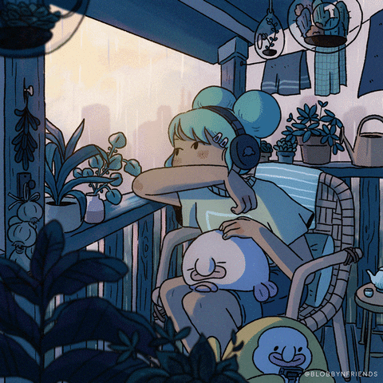

<h1 align="center"/> 👾 Welcome Traveller! 👾 </h1>

    

      <h3 style="text-align: center;">🧑‍💻 About me:</h3>
      
"My name is Gabriel Luna. I'm a computer science student venturing into the world of development. Currently, I work as a freelance back-end developer specializing in web development. This GitHub profile will serve as my playground. I'm presently delving into basic computer concepts such as algorithms and data structures to establish a strong foundation. Additionally, I'm enjoying building Node.js applications using the Nest framework."

    

   

 

---

<h3 align="center">Tech Stacks:</h3> 

    
    
    
    
    

 

---

<h3 align="center">Social:</h3> 

      
 

